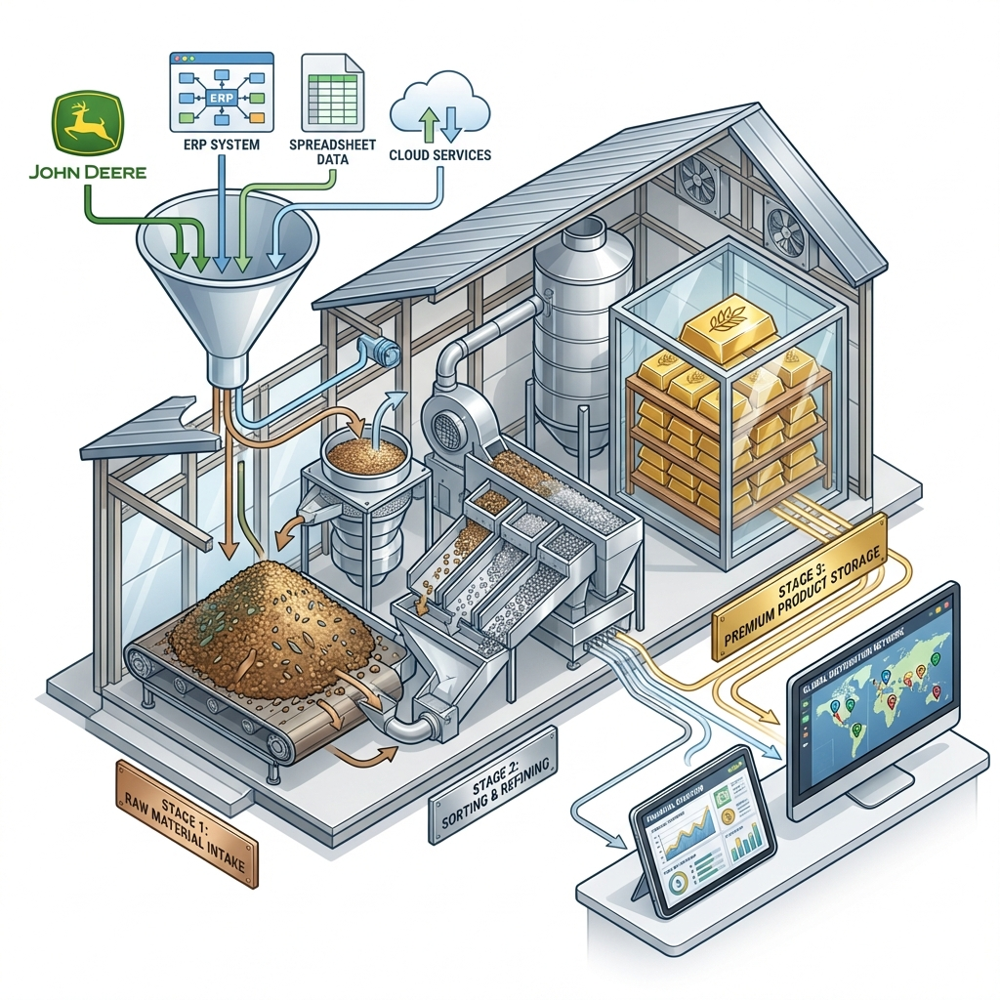
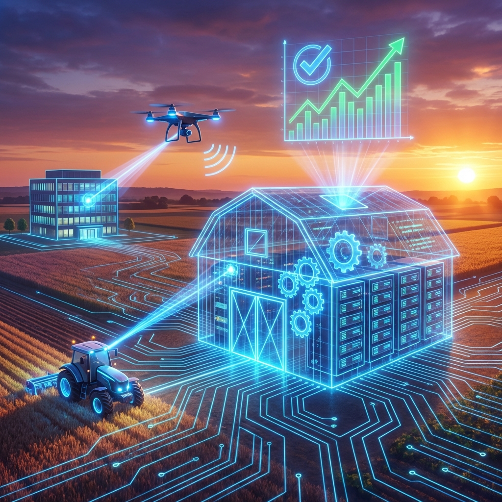
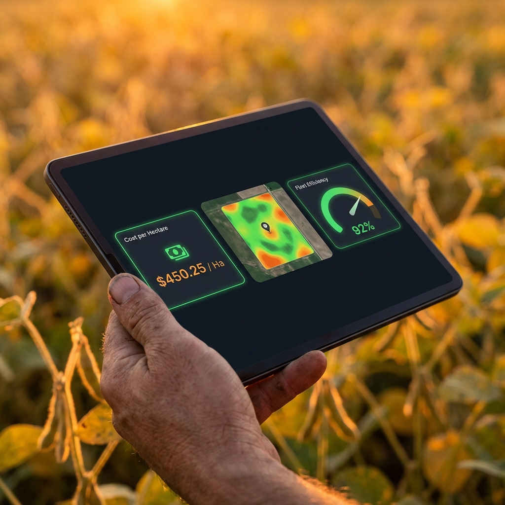
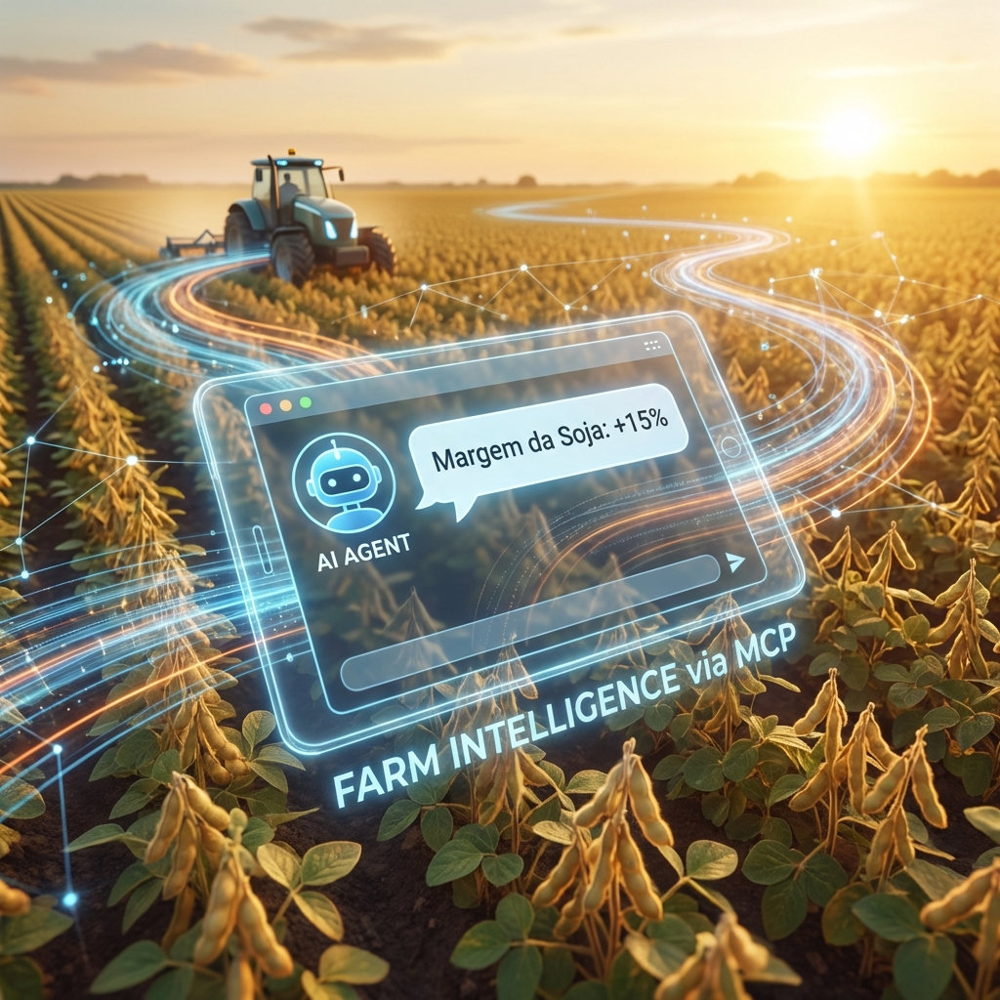

# 🌾 O Armazém de Dados da SOAL: Transformando Dados em Decisões

**Documento de Apresentação e Alinhamento Estratégico**
**Data:** 16 de Janeiro de 2026
**Participantes:** Rodrigo Kugler, Tiago, Claudio Kugler

---

## 1. O Problema: Uma Colheita Abundante, Mas Difícil de Visualizar

Hoje, a SOAL é extremamente eficiente em produzir soja, milho, feijão e... **dados**.

Vocês geram informação o tempo todo:
*   A cada nota fiscal lançada.
*   A cada metro que o trator avança no campo.
*   A cada insumo retirado na Castrolanda.

O problema é que esses dados ficam "estocados" em lugares separados e falam línguas diferentes:
*   **AgriWin** (Financeiro/Estoque)
*   **SharePoint** (Planejamento)
*   **John Deere Operations Center** (Campo)
*   **Castrolanda** (Comercial)

Resultado? Para saber o **Custo Real por Hectare** hoje, vocês precisam fazer um trabalho manual de "catar milho", juntando planilhas e relatórios. Isso gasta tempo (meio dia de trabalho manual!) e pode gerar erros.

**A nossa missão:** Construir uma estrutura automática que faça esse trabalho pesado por vocês.

---

## 2. A Solução: A "Unidade de Beneficiamento" de Dados (Data Warehouse)

Vamos usar um conceito técnico chamado **Data Warehouse**, mas a melhor forma de entender é pensar no processo de **beneficiamento de grãos**.

Não jogamos o grão sujo direto no caminhão de venda. Ele passa por etapas. Com os dados, faremos o mesmo. Chamamos isso de **Arquitetura em Camadas (Medalhão)**.

### O Conceito Visual: Do Bruto ao Ouro

1.  **Camada Bronze (A Lavoura Bruta):**
    *   É o dado cru, exatamente como saiu da máquina ou do sistema.
    *   Se a nota tem erro, ela chega aqui com erro. Se o sensor falhou, o registro está aqui.
    *   *Analogia:* É o caminhão chegando da lavoura com o grão úmido e com impurezas.

2.  **Camada Prata (A Limpeza e Secagem):**
    *   Aqui nossa "máquina" trabalha. Limpamos os erros, padronizamos nomes (Ex: "Soja" e "Soj." viram apenas "Soja"), e cruzamos as informações.
    *   Calculamos custos, rateios e eficiências.
    *   *Analogia:* O grão passando pela pré-limpeza e secador. Agora ele é uniforme e seguro.

3.  **Camada Ouro (O Produto Final):**
    *   É a informação pronta para decisão. Não queremos saber o código da peça, queremos saber **"Quanto custou a manutenção dessa máquina por hora trabalhada?"**.
    *   *Analogia:* O grão classificado, armazenado e pronto para exportação. Valor agregado máximo.

---

## 3. A Metodologia: Construindo a Fazenda Conectada

Não vamos tentar construir tudo de uma vez. Usaremos uma metodologia (baseada em **Kimball**) que foca em *processos de negócio*.

Isso significa que vamos construir "silos" específicos que se conectam, resolvendo uma dor de cada vez, mas garantindo que tudo converse no final.

### Nosso Plano de Ataque:

1.  **Silo 1: Custos Agrícolas (Foco no Claudio)**
    *   Conectar Notas Fiscais + Castrolanda.
    *   **Resultado:** Custo por hectare atualizado automaticamente.

2.  **Silo 2: Eficiência de Máquinas (Foco no Tiago)**
    *   Conectar John Deere + Abastecimento.
    *   **Resultado:** Identificar máquinas que consomem muito ou quebram demais antes disso virar prejuízo.

3.  **Silo 3: A Visão Completa**
    *   Cruzar Financeiro com Operacional.
    *   **Pergunta Respondida:** "O lucro caiu porque o adubo subiu ou porque gastamos diesel demais na colheita?"

---

## 4. O Cenário Futuro: Decisão na Palma da Mão

O objetivo final não é ter relatórios bonitos, mas sim **velocidade e confiança**.

Queremos que o Tiago ou o Claudio possam, no meio da lavoura, puxar o tablet e ver a realidade do negócio em tempo real, sem depender de ninguém montar planilha.

### O Valor Prático (Engenharia Reversa):
Para chegar nessa tela, nós fazemos o caminho inverso:
1.  **Qual a decisão que você precisa tomar?** (Ex: Comprar ou não um trator novo?)
2.  **Qual indicador responde isso?** (Custo de manutenção/hora vs. Valor da parcela nova)
3.  **Onde está esse dado?** (AgriWin e John Deere)
4.  **Como conectamos?** (Construímos a ponte).

---

## 5. O Futuro: Conversando com a Fazenda (IA e Agentes Inteligentes)

Construir o Data Warehouse (o Silo) é apenas o começo. A verdadeira revolução acontece quando conectamos Inteligência Artificial a esses dados organizados.

Hoje, se você perguntar ao ChatGPT "Como reduzir meu custo de soja?", ele vai dar uma resposta genérica de livro.
Mas, com nossos dados organizados e uma tecnologia chamada **MCP (Model Context Protocol)**, nós damos ao ChatGPT as chaves do nosso arquivo.

### O Que Isso Significa na Prática?

Imagine não precisar abrir nenhum painel. Imagine abrir o WhatsApp e perguntar:

> *"Qual gleba teve a pior margem de lucro nesta safra e por quê?"*

Com o MCP, o Agente de IA:
1.  **Lê** o seu Data Warehouse (camada Ouro).
2.  **Identifica** a Gleba 3.
3.  **Analisa** que ali o custo de defensivo foi 30% maior que a média.
4.  **Responde:** *"Foi a Gleba 3. O custo foi R$ 500/ha maior devido a 2 aplicações extras de fungicida em Janeiro."*

Isso não é ficção científica. É o próximo passo natural depois que organizamos a casa. É transformar dados passivos em **consultores ativos** que trabalham 24h por dia para a SOAL.

---

## 6. Próximos Passos Imediatos (Para sair daqui rodando)

Para começar a obra do nosso "Armazém de Dados", precisamos dos materiais básicos hoje.

**Com o Tiago (Técnico):**
*   [ ] **API John Deere:** Precisamos do contato técnico ou acesso de desenvolvedor. É a chave para buscar os dados sem intervenção humana.
*   [ ] **TAG de Abastecimento:** Entender como esse dado é gerado para plugarmos nosso sistema nele.
*   [ ] **Dados Brutos:** Acesso para olhar "a cara" dos dados hoje (exportar relatórios atuais).

**Com o Claudio (Negócio):**
*   [ ] **Validação:** Custo de Safra e Eficiência de Máquinas são as prioridades zero?
*   [ ] **Aprovação:** Podemos iniciar o protótipo (MVP) para entregar os primeiros números em 30 dias?

---

**Resumo:**
Estamos parando de tratar dados como subproduto e passando a tratá-los como **ativo**. Vamos construir o silo que vai armazenar e valorizar o conhecimento de 30 anos da SOAL.
