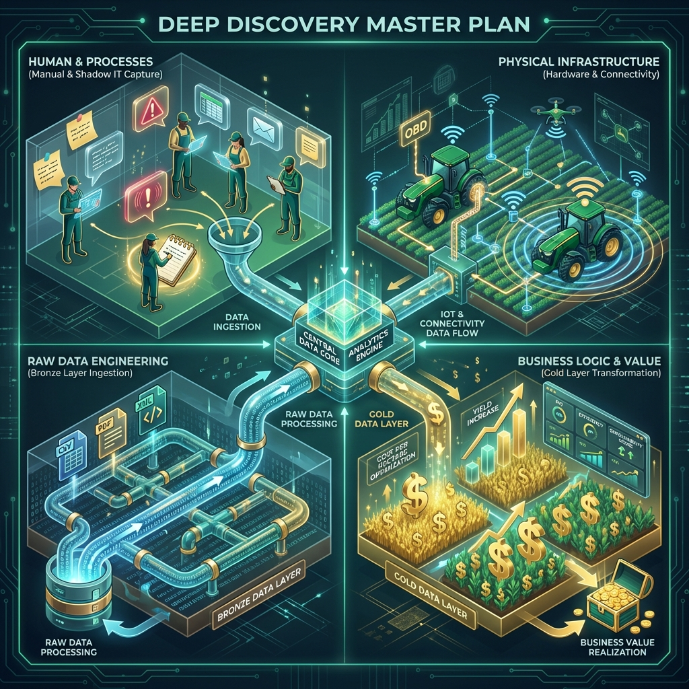

# Plano Mestre de Coleta de Dados e Transformação de Negócio - Projeto SOAL

**Contexto:** Preparação para Deep Discovery Presencial e Engenharia de Dados.
**Responsável:** Rodrigo Kugler 
**Data:** 19/01/2026

---

## 🧭 Visão Geral: A Abordagem "Hybrid Intelligence"

Não estamos apenas instalando um software; estamos digitalizando a intuição de 30 anos da SOAL. Para construir um Data Warehouse (DW) robusto que entregue o "Custo por Hectare em Tempo Real", precisamos descer ao nível atômico do dado e do processo humano que o gera.

Este plano divide a captura em **4 Dimensões Críticas**:

1.  **Dimensão Humana & Processos (Change Management)**
2.  **Dimensão Física (Hardware & Ambiente)**
3.  **Dimensão de Dados Brutos (Engenharia - Camada Bronze)**
4.  **Dimensão Lógica de Negócio (Regras de Ouro)**

---

## 🏛️ PARTE 1: DIMENSÃO HUMANA & PROCESSOS (O "Shadow IT")
*O objetivo é mapear onde o sistema oficial morre e o "jeitinho" assume.*

### 1.1 Mapeamento de Fricção e "Workarounds"
*   **Caça aos Post-its:**
    *   **Capturar:** Fotografar todos os monitores (Valentina, Tiago, Balança). O post-it contém a senha, o código do fornecedor que nunca muda, ou a conversão de unidade que o sistema não faz.
    *   **Objetivo:** Identificar regras de negócio "hardcoded" fisicamente no ambiente.
*   **O "Caminho Feliz" vs. Realidade:**
    *   **Capturar:** Pedir para Valentina processar uma nota fiscal *com problema*. Não a nota perfeita. Como ela resolve quando o código de barras não lê? Quando o fornecedor não está cadastrado?
    *   **Engenharia:** Identificar exceções que quebrarão nossos pipelines de automação (N8N).

### 1.2 Auditoria do "Caderno de Ouro" (Josmar/Secador)
*   **Capturar:** Digitalizar (foto/scan) 1 semana de anotações do caderno de recebimento de grãos.
*   **Análise de UX:**
    *   Qual a ordem dos campos que ele anota? (Data -> Placa -> Peso ou Placa -> Data -> Peso?)
    *   O aplicativo deve seguir *exatamente* essa ordem mental para ter adoção.
    *   Ele usa abreviações? Símbolos? (Isso vira domínio de dados/enum).

### 1.3 A "Planilha Mestre" Oculta
*   **Capturar:** Arquivo físico (USB/Link) de qualquer planilha que o Tiago ou Claudio abram para "conferir se o sistema está certo".
*   **Engenharia:** Esta planilha é a especificação funcional do nosso Dashboard. As colunas dela são nossas medidas e dimensões.

---

## 🚜 PARTE 2: DIMENSÃO FÍSICA (HARDWARE & AMBIENTE)
*O código roda na nuvem, mas o dado nasce na terra/barro.*

### 2.1 Infraestrutura de Conectividade (Network Topology)
*   **Teste de Latência Real:**
    *   Rodar speedtest no wi-fi do Secador, da Oficina e do Escritório Adm.
    *   **Por que?** Para definir se nossos apps precisam de estratégia "Offline-First" (cache local) ou se aguentam requisições em tempo real.
*   **Dispositivos de Ponta:**
    *   O que o Josmar usa? (Celular pessoal Android velho? iPhone novo da empresa?).
    *   O que o Tiago usa no campo? (iPad, Notebook robusto?).
    *   **Impacto:** Define a responsividade e tecnologia do Front-end (AppSheet, PWA, Web).

### 2.2 Interfaces de Máquinas (Legado)
*   **Arqueologia de Hardware:**
    *   Fotografar as portas de diagnóstico (OBD/CAN) dos tratores antigos.
    *   Anotar Modelo/Ano exato para compatibilidade de módulos de telemetria futuros.
*   **Balança Rodoviária:**
    *   Marca e Modelo do indicador digital da balança.
    *   Verificar portas de saída (Serial RS232? USB?).
    *   Verificar se o PC conectado à balança tem acesso à rede/internet (para rodar script de sync).

---

## 💾 PARTE 3: DIMENSÃO DE DADOS BRUTOS (ENGENHARIA - CAMADA BRONZE)
*Aqui extraímos os artefatos técnicos para construir os pipelines ETL.*

### 3.1 Vestro (Combustível) - "A Mina de Ouro"
*   **Ação:** Sentar com Tiago e fazer o processo de *exportação manual* completa.
*   **Capturar:**
    *   Gerar um relatório D-30 (últimos 30 dias) em Excel/CSV.
    *   **Análise de Schema:** Identificar colunas: `ID_Abastecimento`, `Timestamp`, `Litros`, `Horimetro_Atual`, `ID_Veiculo`, `ID_Operador`.
    *   **Validação de Qualidade:** Procurar por `nulls`, campos digitados livremente vs. dropdowns.
    *   **URL de Acesso:** Capturar a URL exata do portal web (para o crawler).

### 3.2 John Deere Operations Center (Telemetria)
*   **Ação:** Navegar no portal com Tiago.
*   **Capturar:**
    *   Exportar um arquivo de "Shapefile" ou relatório de "Operações de Campo" em CSV.
    *   Mapear a taxonomia de nomes: Como os talhões são nomeados no JD? (Eles batem com o AgriWin? **Spoiler: Provavelmente não**. Precisaremos de uma tabela DE-PARA).

### 3.3 AgriWin (O ERP Monolito)
*   **Ação:** Entender a estrutura de dados subjacente.
*   **Capturar:**
    *   Relatórios padrões exportados em CSV/Excel (Plano de Contas, Lançamentos Financeiros, Cadastro de Itens).
    *   Tentativa de acesso direto ao DB (Firebird? SQL Server?): Perguntar ao suporte/TI se existe acesso ODBC/JDBC. Se não, focar 100% em relatórios.
    *   **Taxonomia Financeira:** Capturar a árvore de Centro de Custos completa.

### 3.4 Arquivos Não-Estruturados (PDFs/Notas)
*   **Capturar:** Amostra de 10 PDFs de Notas Fiscais de Fornecedores frequentes (Insumos, Peças).
*   **Engenharia:** Usar essas amostras para treinar/testar o parser de OCR (LLM Vision).

---

## 🧠 PARTE 4: DIMENSÃO LÓGICA DE NEGÓCIO (REGRAS DE OURO)
*Transformando dados em informação. O "Segredo do Molho".*

### 4.1 O Algoritmo do "Custo por Hectare"
Este é o KPI P0 (Prioridade Zero). Não adivinhe, pergunte.
*   **Entrevista Aguda com Claudio:**
    *   *"Como você rateia o diesel?"* (É por área plantada? Por horas máquina apontadas? É um `fator fixo`?).
    *   *"Como você rateia o custo fixo (salário escritório)?"* (Entra no custo da soja ou é despesa operacional separada?).
    *   *"O custo do adubo entra na data da compra ou na data da aplicação?"* (Regime de Caixa vs. Competência). **Crítico para DW.**

### 4.2 Lógica de Manutenção (Tiago)
*   **Definição de "Máquina Quebrada":**
    *   Qual o critério para considerar uma máquina indisponível? (Parada > 2h? Ordem de Serviço aberta?).
    *   Como ele calcula "Eficiência"? (Horas Motor ligado vs. Horas Trabalho Real/Trilha).

### 4.3 Taxonomia Unificada (Padronização)
*   **O Grande Desafio de Integração:**
    *   Criar a "Pedra de Roseta" dos nomes.
    *   `Talhao_01` no AgriWin = `Gleba_Um` no John Deere?
    *   `Soja Intacta` na Nota Fiscal = `Soja Safra 25/26` no Vestro?
    *   **Ação:** Criar uma planilha de DE-PARA preliminar com Tiago e Alessandro.

---

## 📦 ENTREGÁVEIS PÓS-VISITA (OUTPUT ESPERADO)

Ao voltar dessa missão, devemos ter em mãos o "Kit de Construção":

1.  📁 **Data Lake Inicial:** Uma pasta ("Bronze") contendo amostras reais (CSVs, XMLs, JSONs, PDFs) de todos os sistemas.
2.  🗺️ **Diagrama de Entidade-Relacionamento (DER) Lógico:** Rascunho de como as tabelas se conectam (Chaves Primárias e Estrangeiras).
3.  📸 **Galeria de UX/UI:** Fotos dos ambientes físicos para desenhar interfaces que o operador consiga usar com a mão suja de graxa.
4.  📜 **O "Livro de Regras":** Documento descrevendo logicamente os cálculos de Custo e Rateio validado pelo Claudio.

---
**Nota do Advisor:** *Não volte sem as senhas. Não volte sem os arquivos de amostra. A promessa é mágica (IA), mas o trabalho é braçal (Engenharia de Dados).*

---

## 🎨 Visualização do Plano Mestre de Coleta

*Figura 1: Representação visual das 4 dimensões de captura de dados (Humana, Física, Engenharia, Negócio).*

---

## 🗓️ O CHECKLIST TÁTICO: A Missão de Sexta-Feira
*Imprima ou use este quadro para garantir que nada fique para trás.*

### 🛠️ Kit de Sobrevivência (Antes de Sair)
- [ ] Laptop com bateria carregada + Carregador
- [ ] Celular com espaço para fotos/vídeos (4k se possível para ler letras pequenas)
- [ ] Cabo USB/Pen-drive (caso a internet falhe para pegar arquivos)
- [ ] Caderno físico para anotações rápidas (passa credibilidade)

### 📋 A Lista de Coleta (The "Go-Bag")

| Status | 🏷️ Dimensão | 📍 Local / Quem | 🔨 Tarefa | 📦 O Que Trazer (Output Real) | ⭐ Prio |
|:---:|:---|:---|:---|:---|:---:|
| [ ] | **Humana** | Adm (Valentina) | **Caça aos Post-its:** Fotografar bordas de monitores e mesas. | 📸 Fotos legíveis de senhas/códigos | **P0** |
| [ ] | **Humana** | Adm (Valentina) | **Auditoria de Erro:** Pedir para simular erro em NFe. | 📝 Anotação do processo manual | P1 |
| [ ] | **Humana** | Secador (Josmar) | **Digitalizar Caderno:** Escanear 1 semana de anotações. | 📸 Fotos sequenciais (ordem de campo) | **P0** |
| [ ] | **Humana** | Escritório (Tiago) | **Planilha Mestre:** Pegar a planilha que ele "confia". | 💾 Arquivo `.xlsx` | **P0** |
| [ ] | **Física** | Secador / Oficina | **Speedtest:** Testar Wi-Fi nos pontos críticos. | 📝 Screenshot do resultado (Ping/Up/Down) | P1 |
| [ ] | **Física** | Campo / Secador | **Audit de Dispositivos:** O que eles usam na mão? | 📝 Modelo exato (Android 9? iPhone 13?) | P1 |
| [ ] | **Física** | Pátio (Tratores) | **Arqueologia OBD:** Ver porta de diagnóstico de 2 tratores velhos. | 📸 Foto nítida do conector | P2 |
| [ ] | **Física** | Balança | **Hardware da Balança:** Ver conexões atrás do PC/Indicador. | 📸 Foto das portas (USB/Serial) | P1 |
| [ ] | **Dados** | Portal Vestro | **Extração Combustível:** Baixar dados brutos. | 💾 CSV/Excel dos últimos 30 dias | **P0** |
| [ ] | **Dados** | JD Operations | **Extração Telemetria:** Baixar dados brutos. | 💾 Shapefile ou CSV de Operações | **P0** |
| [ ] | **Dados** | AgriWin | **Mapeamento Financeiro:** Entender estrutura. | 💾 CSV Plano de Contas + Relatório Exemplo | **P0** |
| [ ] | **Dados** | Adm (Arquivos) | **Amostragem OCR:** Coletar notas variadas. | 💾 10 PDFs de NFe (Insumos/Peças) | P1 |
| [ ] | **Negócio** | Sala Reunião (Claudio) | **Regra de Ouro:** Definir algoritmo de Custo. | 📝 Fórmula escrita: Rateio Diesel/Fixo | **P0** |
| [ ] | **Negócio** | Sala Reunião (Tiago) | **Regra Máquina:** Definir "Quebra" vs "Parada". | 📝 Critério lógico (ex: >2h parado) | P1 |
| [ ] | **Negócio** | Geral | **Pedra de Roseta:** Mapear nomes diferentes para mesma coisa. | 💾 Planilha DE-PARA (Talhões/Culturas) | **P0** |

### 🛑 "Do Not Leave Without" (Não saia sem isso)
1.  **Acesso Vestro:** Login e Senha (ou usuário convidado criado).
2.  **Acesso John Deere:** Login Developer ou exportação feita na hora.
3.  **Contato TI Castrolanda:** Nome e Zap do responsável pela API.

