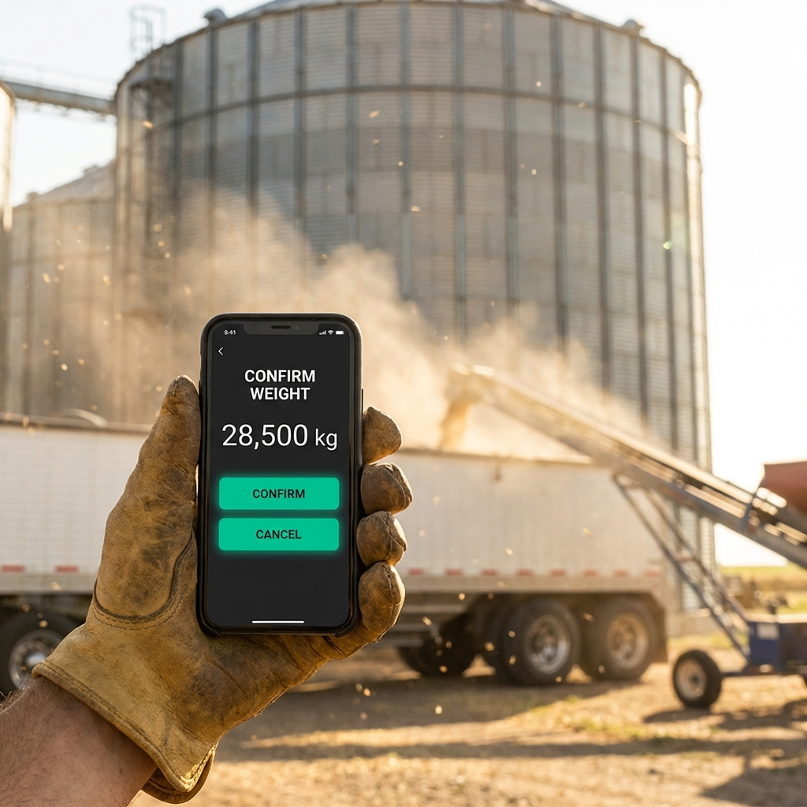
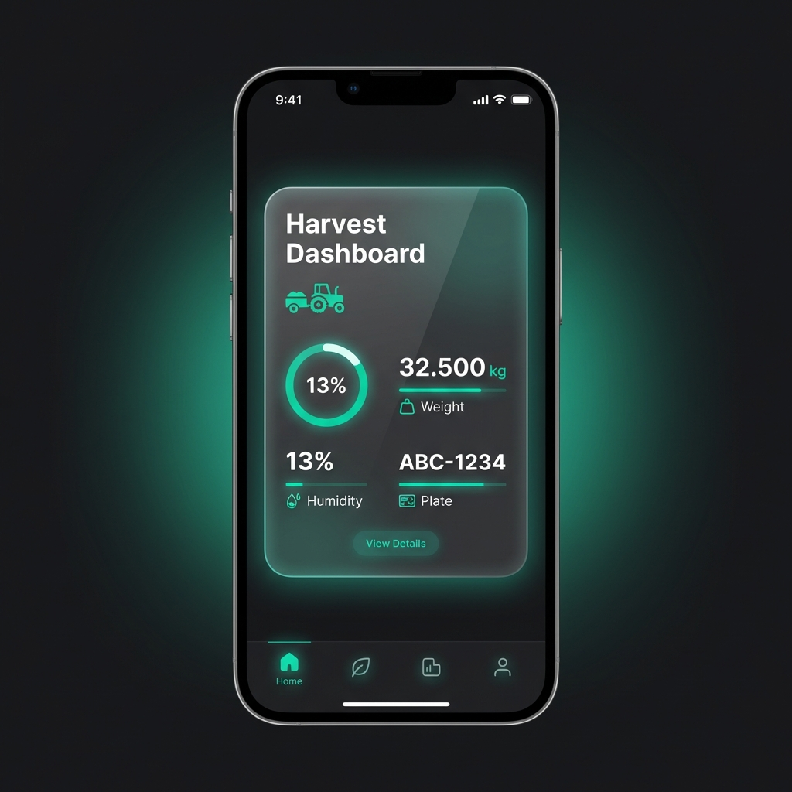
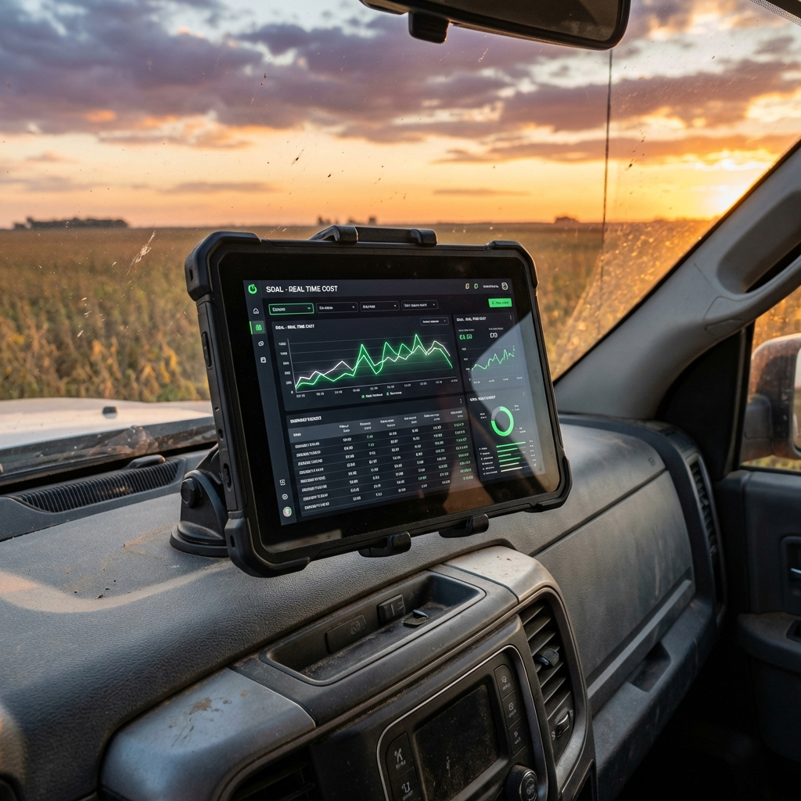

# 🚜 Projeto SOAL: A Fazenda Conectada
## Da Intuição à Precisão do Dado

**Apresentação de Conceito & Protótipo**
*Rodrigo Kugler | DeepWork AI*

---

# 1. A Missão

Hoje, a SOAL é eficiente na produção, mas "cega" no custo real em tempo real.

Nossa missão não é instalar um software.
É **digitalizar a intuição de 30 anos da fazenda**, garantindo que cada dado coletado (do secador ao abastecimento) se transforme em lucro por hectare.

---

# 2. O Problema: "Atrito de Dados"

Por que os dados não chegam no escritório?

*   ❌ Sistemas complexos demais para o campo.
*   ❌ Telas pequenas, botões difíceis, senhas esquecidas.
*   ❌ "Se dá trabalho, o operador anota no papel".

O **Papel** é o inimigo da **Decisão em Tempo Real**.

---

# 3. A Solução: Design "Field Ops"

Desenhamos uma interface pensando no **Josmar no secador** e no **Tiago na lavoura**.
Não é um sistema de escritório. É uma ferramenta de trabalho.

*   ✅ **Alto Contraste:** Para ler no sol do meio-dia.
*   ✅ **Botões Gigantes:** Para usar com luva ou mão suja.
*   ✅ **Fluxo Rápido:** Menos de 10 segundos para lançar um dado.

---

## A Visão do Operador (Simplicidade Radical)

Imagine o Josmar no recebimento. Ele não quer navegar em menus. Ele quer confirmar o peso e voltar ao trabalho.

*   **Identidade Visual Robusta**
*   **Foco na Tarefa Única**
*   **Zero Fricção**

---

## A Interface (Clareza de Dados)

O dado entra limpo. A validação acontece na hora.

### Design System "Dark Mode"
*   Economia de bateria (telas OLED).
*   Descanso visual para o operador.
*   Cores vibrantes (`DeepWork Teal`) apenas onde a atenção é necessária.
*   Isso garante que o dado de **Umidade** e **Peso** entre correto no Banco de Dados.

---

# 4. O Resultado para a Gestão

Quando o dado entra limpo na ponta, a mágica acontece na gestão.
O objetivo é entregar **isso** para o Claudio e o Tiago:

*Decisões baseadas em dados, tomadas de dentro da caminhonete.*

---

# 5. Plano Tático (O Próximo Passo)

Para chegar nessa tela bonita, precisamos construir o alicerce ("A Engenharia").

**Nossa Missão Amanhã (Discovery):**
1.  🕵️ **Mapear a Realidade:** Fotografar os cadernos, planilhas e "gambiarras" (elas são a verdade do processo).
2.  💾 **Capturar Amostras:** Baixar dados brutos do Vestro e JD Operations.
3.  🤝 **Validar com Operadores:** Mostrar as telas acima e perguntar "Você usaria isso?".

---

# O Futuro Começa Agora

Estamos prontos para transformar a SOAL em uma referência de **Gestão Baseada em Dados**.

Vamos ao trabalho.

---
