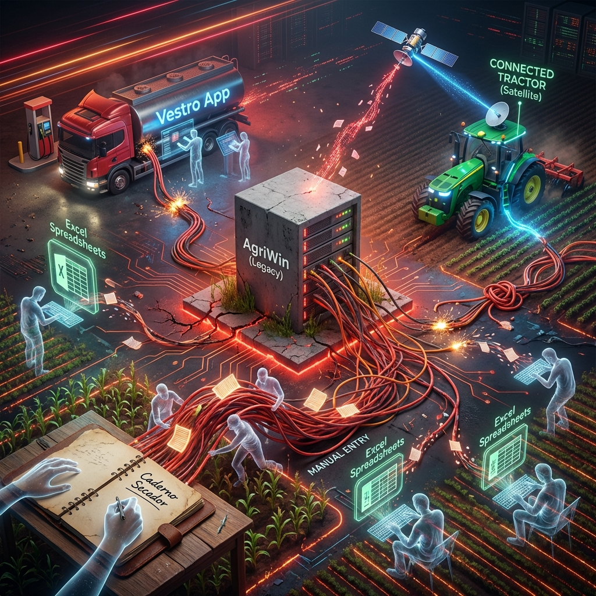
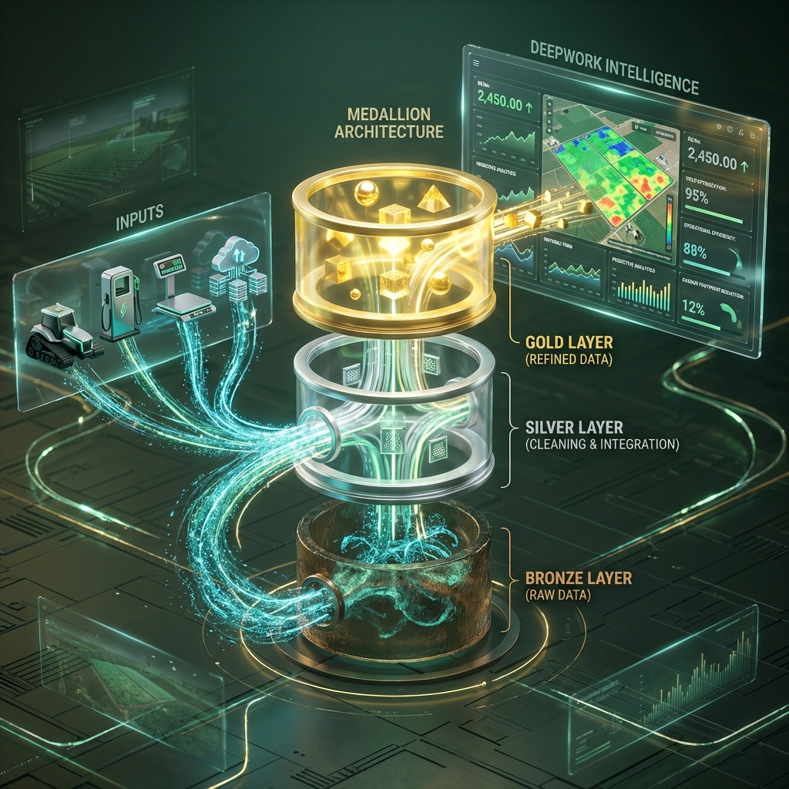

# RELATÓRIO DIAGNÓSTICO

**Serra da Onça Agropecuária LTDA (SOAL)**

---

**Data Intelligence e Transformação Operacional**

Preparado por: DeepWork AI Flows
Data: 29/01/2026
Versão: 1.0

---

*"Transformando intuição em precisão"*

---

## Sumário Executivo

### Contexto

A Serra da Onça Agropecuária (SOAL) opera aproximadamente 2.150 hectares de produção de grãos na região de Piraí do Sul, Paraná. A operação combina agricultura (soja, milho, feijão), beneficiamento de grãos, pecuária de corte e gestão de frota mecanizada. O faturamento agrícola anual gira em torno de R$ 20 milhões, com compromissos financeiros de R$ 32 milhões para a safra 2025/26.

### Desafio Central

A operação gera dados em fontes primárias desconectadas (John Deere Operations Center, Vestro, Balança e Planilhas de Controle), enquanto o sistema oficial (AgriWin) falha em consolidar a realidade operacional. O desafio não é apenas integrar o AgriWin, mas substitui-lo como centralizador de gestão, conectando diretamente as fontes reais de dados (Cadernetas, Excel, Máquinas) em um novo Data Warehouse proprietário. Decisões estratégicas hoje dependem de 'Shadow IT' que passará a ser a infraestrutura oficial.

### Principais Descobertas

- O ERP (AgriWin) é o sistema oficial, mas não é a fonte de verdade confiável. Planilhas Excel mantidas pelo gerente de máquinas e pela equipe administrativa contêm os dados reais de controle.

- O processo de abastecimento de combustível envolve quatro etapas manuais: operador lança no app Vestro com erros frequentes, Tiago exporta e corrige Excel linha por linha, adiciona colunas que o sistema não tem, e Valentina redigita tudo no AgriWin. Esse fluxo consome dias de trabalho mensalmente.

- Dados de telemetria do John Deere apresentam inconsistências críticas de nomenclatura. O mesmo talhão aparece como "Bonim", "Boninho", "Bonin lado esquerdo" e outras variações, inviabilizando análise histórica.

- A recepção de grãos no secador depende de anotações em caderno de papel, criando risco de perda de dados e ausência de histórico digital.

- A fazenda possui 28 anos de dados históricos (desde 1996), um ativo valioso para análises preditivas que permanece inexplorado.

### Direção Recomendada

Construir um Ecossistema de Dados independente que substitua a função de gestão do AgriWin. Implementar arquitetura Medallion (Bronze/Silver/Gold) ingerindo dados diretamente da fonte (Vestro, Máquinas, Caderno Digital), eliminando a necessidade de dupla digitação no ERP antigo. O novo sistema será a única fonte de verdade para custo por hectare e eficiência operacional.

### Resultado Esperado

Em 90 dias, a operação terá visibilidade em tempo real do custo por hectare por cultura, eliminação do retrabalho manual de correção e digitação de dados de combustível, e uma base estruturada para escalar a integração com outras fontes de dados.

---

## Análise do Estado Atual

### Contexto Operacional

A SOAL representa um caso de operação agrícola madura tecnologicamente mas fragmentada em termos de dados. A empresa investe pesadamente em equipamentos (mais de R$ 20 milhões em maquinário John Deere, R$ 20 milhões no secador) e foi reconhecida como "modelo de atuação" pela John Deere na região devido ao uso avançado de telemetria.

O paradoxo é que, apesar do investimento em tecnologia de ponta, a gestão financeira e operacional ainda depende de processos manuais extensivos e planilhas paralelas.

**Escala da Operação**

| Métrica | Valor |
|---------|-------|
| Área agrícola total | 2.150 ha |
| Soja | 1.800 ha |
| Milho | 373 ha |
| Feijão | 177 ha |
| Faturamento agrícola 2024 | R$ 20M |
| Compromissos safra 25/26 | R$ 32M |
| Investimento em maquinário | R$ 20M+ |
| Investimento em secador | R$ 20M |
| Dados históricos disponíveis | 28 anos (desde 1996) |

**Stakeholders Mapeados**

| Nome | Função | Responsabilidades | Relevância para o Projeto |
|------|--------|-------------------|--------------------------|
| Claudio Kugler | Diretor/Proprietário | Decisões estratégicas, relacionamento Castrolanda | Principal usuário do dashboard. Quer custo em tempo real. |
| Valentina | Administrativa | Contas pagar/receber, banco, cooperativa, notas fiscais | Sofre com processo manual de notas. Usuário crítico do sistema. |
| Tiago Kwasnieski | Gerente de Máquinas | Tecnologia, manutenção, otimização de frota | Champion técnico interno. Já implementou Vestro. |
| Alessandro | Agrônomo | Receituário agronômico, defensivos | Fonte de dados de insumos e aplicações. |
| Josmar | Operador Secador | Recepção de grãos, controle de estoque | Ponto crítico de entrada de dados. Usa caderno de papel. |

### Sistemas e Paisagem de Dados

| Sistema | Função | Qualidade dos Dados | Status de Integração | Observações |
|---------|--------|---------------------|---------------------|-------------|
| AgriWin | ERP financeiro e operacional | Média | Isolado | Sistema oficial mas não confiável. Histórico limitado a 2 anos. |
| SharePoint (Excel) | Planejamento financeiro | Alta | Isolado | Fonte de verdade para contas pagar/receber e orçamento. |
| Castrolanda | Insumos e vendas | Alta | Via AgriWin (API existe) | Dados de insumos, financiamentos, saldo cooperativa. |
| John Deere Operations Center | Telemetria de máquinas | Baixa (nomenclatura) | Isolado | Dados de campo com inconsistências de nomes de talhões. |
| Vestro | Abastecimento combustível | Média | Manual (Excel) | App funciona, mas dados precisam correção manual. |
| Caderno Josmar | Recepção de grãos | Baixa | Inexistente | Papel físico sem digitalização. Risco de perda. |

### Mapeamento de Processos Críticos

**Processo 1: Cálculo de Custo por Hectare**

- **Fluxo Atual:** Claudio acessa Castrolanda para ver insumos, abre AgriWin para diesel e manutenção, consulta Excel para mão-de-obra e arrendamentos. Manualmente divide valores por área plantada. Calcula sacas necessárias para cobrir custo. Compara com preço de mercado para estimar margem.

- **Pontos de Fricção:** Dados em três sistemas diferentes. Nenhuma visão consolidada. Processo consome "meio dia" cada vez que precisa ser feito. Decisões estratégicas baseadas em cálculos pontuais, não em visão contínua.

- **Workaround Atual:** Claudio faz o cálculo quando "tem tempo", geralmente antes de reuniões com banco ou cooperativa.

- **Impacto nos Stakeholders:** Decisões de compra de insumos, venda de produção e planejamento de safra são tomadas sem visibilidade completa do custo real.

**Processo 2: Fluxo Vestro para AgriWin (Combustível)**

- **Fluxo Atual:** Operador abastece e lança no app Vestro. Frequentemente erra o horímetro (digita 540.00 em vez de 5400.0). Tiago exporta Excel a cada 15-30 dias. Abre arquivo e corrige linha por linha. Adiciona colunas manuais (fazenda, operação) que o Vestro não captura. Envia para Valentina. Valentina digita manualmente no AgriWin para custeio.

- **Pontos de Fricção:** Erro humano na digitação do horímetro. Correção manual linha por linha. Informações contextuais (qual operação, qual fazenda) não são capturadas na fonte. Dupla digitação: Vestro para Excel, Excel para AgriWin.

- **Workaround Atual:** Tiago desenvolveu expertise em identificar erros de horímetro pelo padrão (valores muito baixos ou muito altos).

- **Impacto nos Stakeholders:** Tiago perde horas mensais em correção de planilha. Valentina perde horas redigitando. Custo de combustível por máquina só fica disponível com atraso de semanas.

**Processo 3: Recepção de Grãos no Secador**

- **Fluxo Atual:** Caminhão chega com carga. Josmar pesa na balança. Anota em caderno: placa, peso, umidade, origem (talhão). No fim do dia ou semana, dados são passados para sistema (ou não).

- **Pontos de Fricção:** Caderno de papel pode ser perdido ou danificado. Caligrafia pode ser ilegível. Dados não estão disponíveis em tempo real. Histórico de recepção não é facilmente consultável.

- **Workaround Atual:** Josmar mantém o caderno "organizado do jeito dele". Ordem dos campos segue sua lógica mental.

- **Impacto nos Stakeholders:** Claudio não tem visibilidade em tempo real do que entrou no secador. Reconciliação com notas fiscais é feita manualmente.

### Shadow IT e Sistemas Informais

A descoberta mais significativa do processo de discovery foi a existência de sistemas paralelos que funcionam como a verdadeira fonte de verdade:

**Planilha Mestre do Tiago**

Tiago mantém uma planilha Excel que ele consulta para "conferir se o sistema está certo". Esta planilha contém:
- Consumo real por máquina (corrigido)
- Histórico de manutenções
- Análise comparativa de eficiência entre tratores

Foi através desta planilha que Tiago descobriu que tratores de 170cv são mais eficientes que os de 210cv para certas operações, gerando economia significativa na estratégia de compra.

**Planilhas do SharePoint (Valentina/Claudio)**

O planejamento financeiro real da operação vive em Excel no SharePoint:
- Contas a pagar (programação semanal)
- Contas a receber
- Orçamento anual (R4 32M em compromissos)
- Folha de pagamento

O AgriWin é usado para registro, mas o controle é feito no Excel.

**Caderno do Josmar**

A entrada de grãos no secador é registrada em um caderno físico. Este caderno é:
- A única fonte de dados de recepção em tempo real
- Vulnerável a perda ou dano
- Impossível de consultar historicamente sem digitação manual

---

## Descobertas do Diagnóstico

### Descoberta 1: Fragmentação de Dados Impede Gestão Estratégica

**Observação:** A operação gera dados relevantes em cinco sistemas diferentes, mas nenhum deles oferece visão consolidada. O diretor precisa abrir três aplicações simultaneamente para tomar decisões básicas.

**Evidência:** Citação direta de Claudio Kugler: "Eu queria estar olhando numa tela e dizendo: até agora o meu custo de soja tá assim. Eu não consigo enxergar isso hoje, eu não tenho." Esta frase foi repetida quatro vezes durante a sessão de discovery.

**Causa Raiz:** Os sistemas foram adquiridos para resolver problemas pontuais (ERP, combustível, telemetria) sem uma estratégia de integração. O AgriWin, que deveria ser o hub central, tem limitações de integração com ferramentas externas e histórico limitado a dois anos.

**Impacto no Negócio:** Decisões de compra de insumos, venda de produção e planejamento de caixa são tomadas com informação incompleta. O cálculo manual de custo por hectare consome "meio dia de trabalho" e só é feito pontualmente, não como prática contínua.

**Severidade:** Crítica

---

### Descoberta 2: Retrabalho Manual Extensivo no Fluxo de Combustível

**Observação:** O processo de registro de abastecimento envolve quatro etapas manuais e duas digitações completas do mesmo dado.

**Evidência:** Tiago demonstrou o processo: exporta Excel do Vestro, abre arquivo, corrige horímetros errados linha por linha (operadores digitam 540.00 em vez de 5400.0), adiciona colunas que o sistema não tem (fazenda, operação), envia para Valentina que redigita no AgriWin.

**Causa Raiz:** O sistema Vestro captura dados básicos mas não tem campos para contexto operacional. Não existe validação automática de horímetro (o sistema aceita qualquer valor). Não existe integração entre Vestro e AgriWin.

**Impacto no Negócio:** Tiago e Valentina perdem horas mensais em tarefas de correção e digitação. O custo real de combustível por operação só fica disponível semanas depois do consumo. Erros de digitação que passam despercebidos distorcem a análise de custos.

**Severidade:** Alta

---

### Descoberta 3: Dados de Telemetria John Deere Inutilizáveis para Análise Histórica

**Observação:** Os dados de operações de campo no John Deere Operations Center apresentam inconsistências de nomenclatura que impedem qualquer análise histórica por talhão.

**Evidência:** Tiago mostrou na tela: o mesmo talhão aparece como "Bonim", "Boninho", "Bonin lado esquerdo" e outras variações. Os operadores digitam o nome livremente, sem lista padronizada.

**Causa Raiz:** O sistema John Deere permite entrada livre de texto para nome de talhão. Não existe validação ou lista de valores permitidos. Cada operador escreve do seu jeito.

**Impacto no Negócio:** Impossível responder perguntas como "qual foi a produtividade do talhão Bonim nos últimos 5 anos?" sem trabalho manual extensivo de normalização. O valor da telemetria avançada (R$ 20M+ em maquinário) é subutilizado.

**Severidade:** Alta

---

### Descoberta 4: Ponto Único de Falha na Recepção de Grãos

**Observação:** Toda a entrada de grãos no secador depende de anotações em caderno de papel feitas por um único operador.

**Evidência:** Josmar registra manualmente: placa do caminhão, peso, umidade, origem (talhão). O caderno é a única fonte desses dados até serem digitados posteriormente (quando são).

**Causa Raiz:** Nunca foi implementado um sistema digital para recepção de grãos. A balança gera ticket, mas não há integração com sistema de gestão. O processo "funciona" porque Josmar é confiável.

**Impacto no Negócio:** Risco de perda de dados se o caderno for extraviado ou danificado. Impossibilidade de consulta em tempo real do que entrou no secador. Reconciliação com notas fiscais depende de digitação manual. Nenhuma rastreabilidade automática da origem dos grãos.

**Severidade:** Média (risco latente)

---

### Descoberta 5: Ativo Estratégico Inexplorado - 28 Anos de Dados Históricos

**Observação:** A fazenda possui registros de produtividade, rotação de culturas e resultados por gleba desde 1996.

**Evidência:** Claudio mostrou dados históricos por gleba: "Isso não é todo produtor que tem." Exemplo: Gleba Lagoa (24ha) tem registros de produção desde 2016, permitindo análise de tendência.

**Causa Raiz:** Os dados estão em formatos antigos (pastas salvas, planilhas legadas) sem estrutura unificada. O AgriWin só mantém dois anos de histórico acessível.

**Impacto no Negócio:** Potencial para modelos preditivos de produtividade permanece inexplorado. Decisões de rotação de cultura e alocação de insumos poderiam ser otimizadas com análise histórica. Vantagem competitiva não utilizada.

**Severidade:** Oportunidade (não é problema, mas potencial não realizado)

---

### Avaliação da Arquitetura de Dados

**Estado Atual: Silos Desconectados**

**Estado Proposto: Data Warehouse Medallion**

### Mapa de Oportunidades

| Oportunidade | Estado Atual | Estado Alvo | Impacto Estimado |
|--------------|--------------|-------------|------------------|
| Dashboard Custo/ha | Cálculo manual (meio dia) | Atualização automática diária | 20+ horas/mês recuperadas |
| Automação Vestro | 4 etapas manuais, 2 digitações | Ingestão automática com correção | 15+ horas/mês recuperadas |
| Normalização John Deere | Dados inutilizáveis | Análise histórica possível | Decisões de alocação otimizadas |
| Digitalização Secador | Caderno de papel | App simples ou OCR | Eliminação de risco de perda |
| Análise Histórica 28 anos | Dados em pastas antigas | Data Lake estruturado | Modelos preditivos de produtividade |

---

## Solução Proposta

### Abordagem Estratégica

A transformação será conduzida através da metodologia de 4 Dimensões, que garante que a solução técnica esteja alinhada com a realidade operacional:

**1. Dimensão Humana**

Mapear os processos reais (não os oficiais) e desenhar interfaces que respeitem o fluxo mental dos usuários. O app de entrada de dados deve seguir a ordem que Josmar já usa no caderno. A automação deve eliminar trabalho, não criar novos passos.

**2. Dimensão Física**

Considerar as condições de campo: conectividade variável (Starlink em áreas remotas), dispositivos de diferentes gerações (celular do operador vs tablet da empresa), ambiente hostil (poeira, graxa, vibração).

**3. Dimensão de Engenharia de Dados**

Construir pipeline ETL robusto que assume que dados virão sujos e que a internet pode cair. Estratégia offline-first para coleta em campo. Validações automáticas na camada Silver.

**4. Dimensão de Lógica de Negócio**

Documentar e codificar as "regras de ouro" do Claudio: como ratear diesel, como alocar custo fixo, regime de caixa vs competência. Essas regras são o "segredo do molho" que torna os dados úteis.

### Implementação em Fases

**Fase 1: Fundação (MVP)**

Escopo:
- Integração automatizada do Vestro com correção de horímetro
- Dashboard de custo por hectare consolidando Castrolanda + SharePoint + Vestro
- Tabela DE-PARA para normalização de nomes de talhões

Entregáveis:
- Pipeline N8N coletando dados diariamente
- PostgreSQL com camadas Bronze e Silver
- Dashboard Power BI com custo/ha por cultura
- Comparativo com preço de mercado e margem projetada

Critérios de Sucesso:
- Claudio consegue ver custo atualizado em menos de 5 minutos (vs meio dia)
- Tiago não precisa mais corrigir planilha Vestro manualmente
- Valentina não precisa redigitar dados de combustível no AgriWin

**Fase 2: Expansão**

Escopo:
- Integração completa John Deere Operations Center
- Digitalização da recepção de grãos (app ou OCR do caderno)
- Automação de notas fiscais (pasta monitorada + OCR)

Entregáveis:
- API John Deere conectada ao Data Warehouse
- App mobile para Josmar (entrada de grãos)
- Automação de leitura de PDF de notas fiscais

**Fase 3: Inteligência**

Escopo:
- Migração dos 28 anos de dados históricos
- Modelos preditivos de produtividade por gleba
- ChatGPT MCP para consultas em linguagem natural
- Alertas proativos via WhatsApp

Entregáveis:
- Data Lake com histórico completo desde 1996
- Modelo de previsão de safra por gleba
- Interface conversacional para consulta de dados
- "Morning Briefing" automático via áudio WhatsApp

### Arquitetura Técnica

Tecnologias selecionadas:

| Função | Ferramenta | Justificativa |
|--------|------------|---------------|
| ETL/Automação | N8N | Prototipagem rápida, foco em regra de negócio, migrável para Python |
| Banco de Dados | PostgreSQL | Baixo custo, robusto, suporta arquitetura Medallion |
| BI/Visualização | Power BI | Cliente já conhece, rápido de implementar |
| IA/Consultas | ChatGPT Plus + MCP | Interface natural, sem necessidade de treinamento |
| Coleta Campo | App PWA ou AppSheet | Funciona offline, interface simples |

---

## Esforço e Investimento

### Detalhamento do Esforço da Equipe de Discovery

| Atividade | Descrição | Horas Estimadas |
|-----------|-----------|-----------------|
| Discovery e Mapeamento | Entendimento do negócio, levantamento de fontes, definição de métricas, requisitos de segurança | 6 - 8h |
| ETL - Vestro (Combustível) | Conexão com portal, tratamento de horímetro, carga automática | 6 - 10h |
| ETL - Castrolanda/AgriWin | Integração via API existente, mapeamento de campos | 6 - 10h |
| ETL - SharePoint (Excel) | Conexão direta, monitoramento de alterações | 4 - 8h |
| ETL - John Deere | API de telemetria, normalização de talhões | 6 - 10h |
| Dashboard Operacional | Custo/ha por cultura, comparativo mercado, até 10 métricas | 6 - 8h |
| Dashboard Gestão | Consolidação executiva, KPIs estratégicos, drill-down | 8 - 12h |

### Estimativa do Projeto SOAL - Fase 1 (MVP)

| Componente | Horas (Range) | Investimento (R$) |
|------------|---------------|-------------------|
| Discovery e Mapeamento | 6 - 8h | R$ 900 - R$ 1.440 |
| ETL Vestro | 8 - 10h | R$ 1.200 - R$ 1.800 |
| ETL Castrolanda/AgriWin | 6 - 8h | R$ 900 - R$ 1.440 |
| ETL SharePoint | 4 - 6h | R$ 600 - R$ 1.080 |
| Dashboard Custo/ha | 8 - 10h | R$ 1.200 - R$ 1.800 |
| **Total Setup Fase 1** | **32 - 42h** | **R$ 4.800 - R$ 7.560** |

*Cálculo baseado em taxa de R$ 150/hora (faixa Pleno)*

### Custos Recorrentes

| Item | Custo Mensal | Observações |
|------|--------------|-------------|
| PostgreSQL Gerenciado | ~US$ 15 (~R$ 75) | DigitalOcean, instância dedicada |
| VPS para N8N | ~US$ 10 (~R$ 50) | Servidor de automação |
| Manutenção Técnica | 4h/mês (~R$ 600) | Ajustes, monitoramento, evolução |
| **Total Mensal** | **~R$ 725** | Infraestrutura + manutenção básica |

### Referência de Taxas Horárias

| Nível | Taxa (R$/hora) |
|-------|----------------|
| Pleno | R$ 120 - R$ 180 |
| Sênior | R$ 180 - R$ 300 |

---

## Proposta de Valor

### Benefícios Quantificados

| Benefício | Situação Atual | Pós-Implementação | Economia Mensal |
|-----------|----------------|-------------------|-----------------|
| Cálculo de Custo/ha | Meio dia por cálculo (~4h) | 5 minutos | ~16h/mês (4 cálculos) |
| Correção Planilha Vestro | 6-8h por exportação | Automático | ~12h/mês |
| Digitação AgriWin (Valentina) | 4-6h por lote | Eliminada | ~8h/mês |
| Reconciliação de dados | Processo fragmentado | Visão unificada | ~8h/mês |
| **Total Horas Recuperadas** | | | **~44h/mês** |

**Valor das Horas Recuperadas:** 44h x R$ 50/hora (custo interno estimado) = **R$ 2.200/mês**

### Análise de ROI

- **Investimento Setup Fase 1:** R$ 6.000 (média do range)
- **Custo Mensal:** R$ 725
- **Economia Mensal:** R$ 2.200
- **Economia Líquida Mensal:** R$ 1.475
- **Payback:** 4.1 meses
- **Valor Líquido em 12 meses:** R$ 11.700

### Benefícios Intangíveis

**Velocidade de Decisão**

Hoje Claudio precisa "ter tempo" para calcular custo. Com o dashboard, a informação está disponível instantaneamente, permitindo decisões mais frequentes e melhor fundamentadas.

**Redução de Erro**

A correção automática de horímetro e a eliminação de dupla digitação reduzem erros que hoje distorcem a análise de custos.

**Escalabilidade**

A metodologia e infraestrutura desenvolvidas para a SOAL podem ser replicadas para outros produtores da região, transformando o projeto em um produto comercializável.

**Preservação de Conhecimento**

Os 28 anos de metodologia do Claudio serão documentados e codificados, transformando conhecimento tácito em ativo da empresa.

**Vantagem Competitiva**

Poucos produtores da região têm capacidade de análise em tempo real. A SOAL poderá tomar decisões mais rápidas e precisas que a concorrência.

---

## Riscos e Mitigações

| Risco | Probabilidade | Impacto | Estratégia de Mitigação |
|-------|---------------|---------|-------------------------|
| API Castrolanda indisponível ou fechada | Média | Alto | Plano B: scraping do portal. Plano C: upload manual de relatório. |
| Resistência de usuários a novo sistema | Média | Médio | Interface que espelha fluxo mental atual. Treinamento hands-on. Quick wins visíveis. |
| Erros de horímetro não detectados pela regra | Baixa | Médio | Regra de validação com threshold. Alertas para valores fora do padrão. Revisão humana opcional. |
| Conectividade instável em campo | Alta | Baixo | Arquitetura offline-first. Sincronização quando conexão disponível. |
| Dados históricos em formato incompatível | Média | Médio | Fase de migração dedicada. Validação com Claudio de dados críticos. |

---

## Próximos Passos

### Ações Imediatas (Cliente)

1. **Claudio:** Fornecer contato técnico da Castrolanda para validação de API
2. **Tiago:** Enviar amostra da planilha Vestro corrigida e planilha de entrada de grãos
3. **Tiago:** Criar usuário convidado no portal Vestro para testes
4. **Claudio:** Confirmar se possui assinatura ChatGPT Plus para fase de IA

### Ações Imediatas (DeepWork)

1. Visita técnica presencial para documentar processo do Josmar e fotografar hardware da balança
2. Contato com suporte John Deere para documentação de API
3. Protótipo de dashboard de custo para validação visual com Claudio
4. Desenho técnico do pipeline Vestro (quick win)

### Pontos de Decisão

- [ ] Aprovar escopo e investimento da Fase 1
- [ ] Confirmar prioridade: Vestro primeiro ou Dashboard primeiro
- [ ] Agendar reunião de kickoff com stakeholders
- [ ] Definir frequência de atualização desejada (diária/semanal)
- [ ] Fornecer acessos aos sistemas (Vestro, SharePoint, AgriWin)

---

## Apêndices

### A. Stakeholders Entrevistados

| Data | Participante | Foco | Duração |
|------|--------------|------|---------|
| Dez/2025 | Claudio Kugler | Discovery geral, pain points, sistemas | 90 min |
| 29/12/2025 | Rodrigo + João (interno) | Decisões estratégicas, stack técnico | 40 min |
| 16/01/2026 | Tiago Kwasnieski + Claudio | Maquinário, Vestro, John Deere | 60 min |

### B. Sistemas com Acesso Necessário

| Sistema | Tipo de Acesso | Status |
|---------|---------------|--------|
| Vestro | Usuário + senha ou API | Pendente |
| John Deere Operations Center | Developer API keys | Pendente |
| Castrolanda | Validar API existente | Pendente |
| SharePoint | Acesso de leitura | Pendente |
| AgriWin | Validar se tem API ou apenas ODBC | Pendente |

### C. Glossário de Termos

| Termo | Definição |
|-------|-----------|
| Talhão | Unidade de área dentro da fazenda, usada para gestão agrícola |
| Horímetro | Contador de horas de funcionamento de uma máquina |
| Safra | Ciclo de produção agrícola, geralmente identificado pelo ano (ex: 25/26) |
| Custeio | Financiamento de curto prazo para insumos da safra |
| Romaneio | Documento de pesagem e classificação de grãos |
| UBG | Unidade de Beneficiamento de Grãos (secador e armazenagem) |
| Shadow IT | Sistemas informais (planilhas, cadernos) usados paralelamente aos oficiais |
| Medallion | Arquitetura de Data Warehouse em camadas (Bronze/Silver/Gold) |

---

**Documento preparado por DeepWork AI Flows**

*Contato: Rodrigo Kugler | João Vitor Balzer*

---
